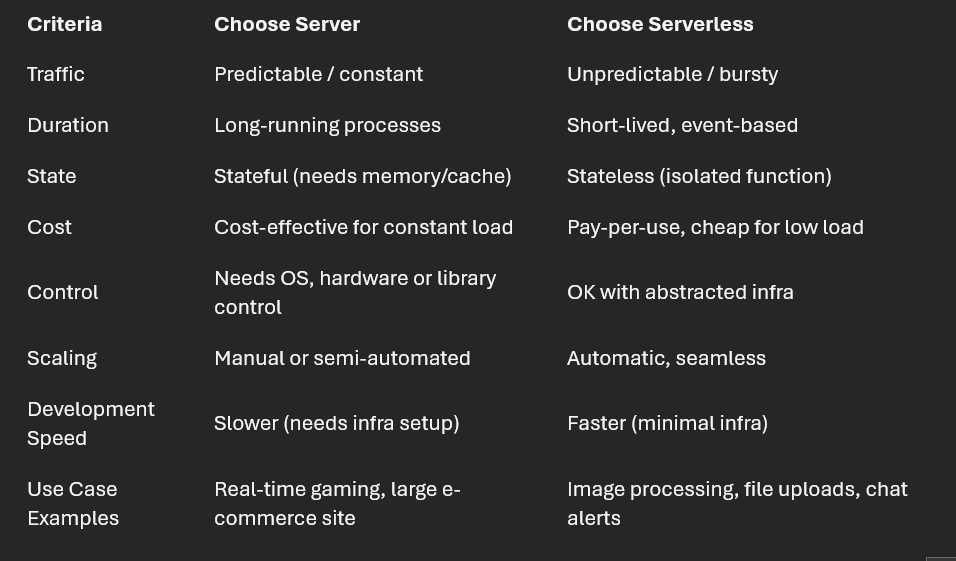

HLD deals with functional and non-functional requirement of the system

1. **What is Server and Serverless Architectures** ?
		In **serverless architecture**, **you write code without managing servers**. The cloud provider handles provisioning, scaling, and maintenance.
		You focus only on the logic (functions or APIs). 
		
	
	In **server-based architecture**, you manage and run servers (physical or virtual) to host your application.
	 
	 ### 📦 Characteristics:
	- You provision the infrastructure (e.g., VMs, containers).
	- You manage OS, patches, scaling, and availability.
	- Often used with **monoliths** or **microservices**.
	
2. **Horizontal and Vertical Scaling** 
		**Horizontal** :- Add more servers/nodes and distribute the load.
		**Vertical** :- Add more resources (CPU, RAM, storage) to the same server
		
3. **What is thread ?**
	Threads allow concurrent execution within a single process. In a web server, for example, using a thread pool lets us handle thousands of simultaneous requests efficiently without blocking the main thread.
	
4. What are pages ?
	 
5. How does internet works ?
	

