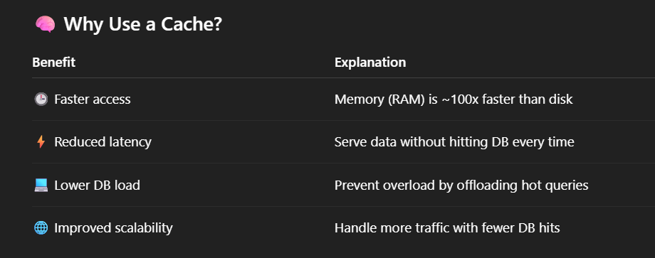
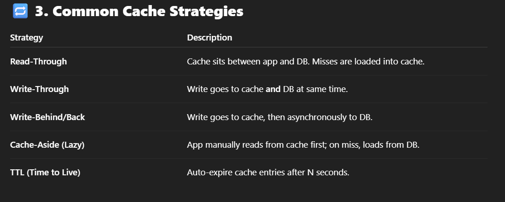
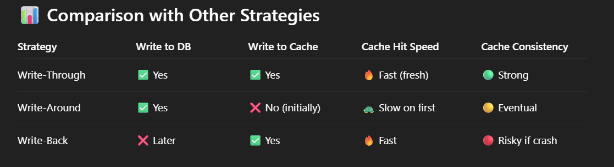
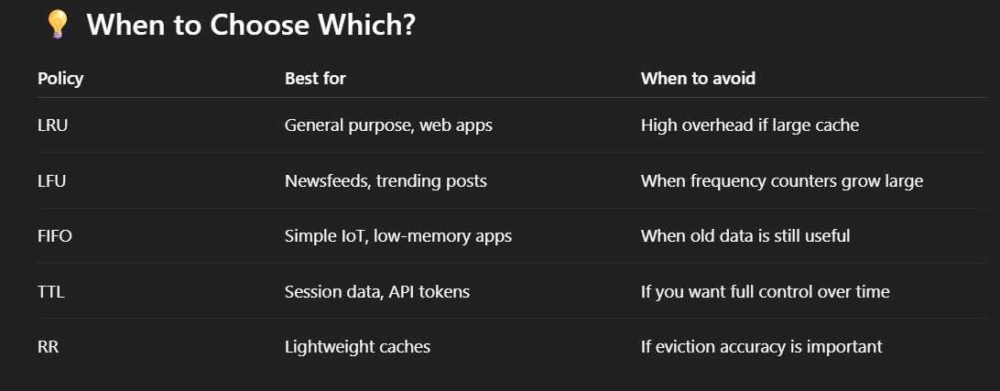
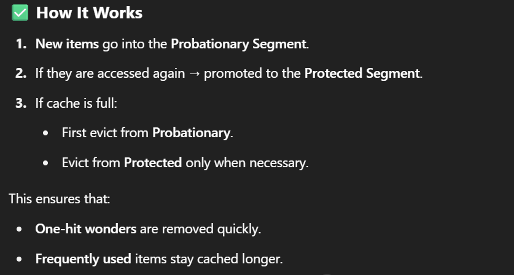
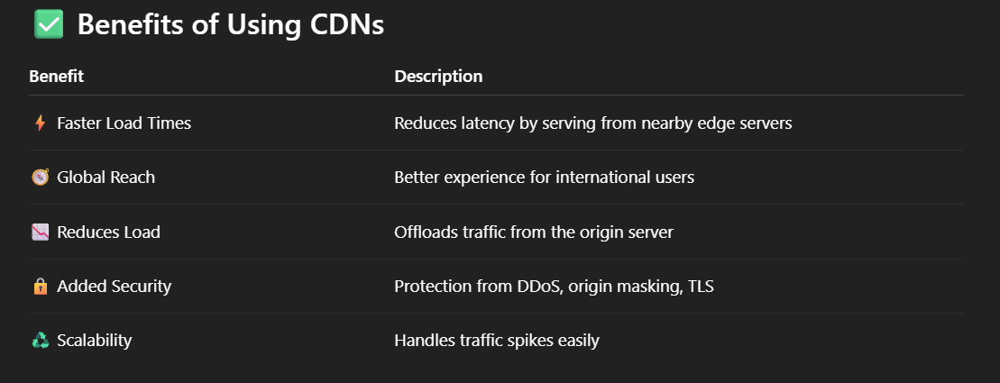
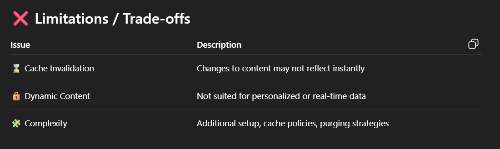
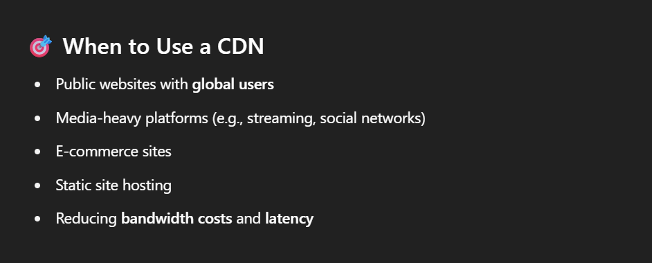

1. What is cache ? (Redis, Memcached)
	A **cache** is a high-speed, temporary storage layer that holds **frequently accessed data** to reduce latency and load on backend systems.
	
	Can you identify **what to cache**?
		=> Product listings, search results, homepage data, session tokens.
    
	Can you explain **where** to place the cache?
		=> We typically place the cache **between the application layer and the database**.  This way, every read or write can check the cache first before going to the slower, persistent DB.  It acts as the **first layer of defense** to reduce DB load and improve response time.
	
	 Do you know about **invalidation** and **staleness**?
		=> Use TTLs, versioning, write-through strategy, or explicit invalidation.
	
2. Write Policies : write back, through and around
	
	
	1) **Cache-aside (Lazy Loading)**
	- App checks cache first.
	- If data not found (**cache miss**) → fetch from DB → update cache → return response.
	- Cache populated _only when needed_.
	- ✅ Pros: Simple, avoids filling cache with unused data.
	- ❌ Cons: First request = slow (miss penalty).
	
	2)  **Write-through
    - Every write goes to **cache + database simultaneously**.
    - Cache always up-to-date.
    - ✅ Pros: Strong consistency between cache & DB.
    - ❌ Cons: Higher write latency (since every write updates 2 places).
    - 💡 Used in: Systems where **reads are frequent and consistency is critical** (e.g., user sessions).
	
	3) Write-back (Write-behind)
	- Write only to **cache** → acknowledge success → later **flush/write** to DB asynchronously.
	- ✅ Pros: Very fast writes, reduces DB load.
	- ❌ Cons: Risk of data loss if cache fails before flushing.
	- 💡 Used in: High-write, less critical systems (e.g., logging, counters, analytics).
	
	4) **Write-around**
    - Write goes **only to DB** (not cache).
    - Cache updated only on next read (lazy).
    - ✅ Pros: Cache not polluted with rarely-read data.
    - ❌ Cons: First read after write = cache miss (slower).
    - 💡 Used in: Systems with **write-heavy but read-sparse** workloads.
	
	5)  **Read-through**
    - Application always queries the cache.
    - If cache miss → cache automatically fetches from DB → stores → returns.
    - ✅ Pros: Transparent for application (simpler app logic).
    - ❌ Cons: Cache becomes bottleneck if not scaled well.
    - 💡 Used in: Distributed caching systems (like Redis with a loader).
	
	1) **Refresh-ahead**
    - Cache **proactively refreshes data** before expiry (TTL).
    - Users always see warm cache.
    - ✅ Pros: Avoids cache misses for frequently accessed data.
    - ❌ Cons: May refresh data that’s never accessed again (wasted work).
    - 💡 Used in: Real-time apps with predictable access patterns (stock prices, trending videos).
    
	

3. Replacement Policies : LFU, RFU, Segmented LRU etc.
	When the cache reaches its **memory limit**, older or less important data must be **evicted (removed)** to make room for new data.
	
	Eviction policies determine **which entries to remove**.
		i) **LRU (Least recently used)** - Removes the item that **hasn’t been accessed in the longest time**.
		ii) LFU (Least Frequently used) - Removes the item that has been **accessed the fewest number of times**.
		iii) **FIFIO (first in first out)** - Removes the **oldest inserted item**, regardless of usage
		iv) **TTL (time to live)** - Automatically expires an item **after a fixed time** since insertion or last access.
		v) Random Replacement (RR) - Randomly removes any item from the cache.
		
	
	
	
	What is **Segmented LRU (SLRU)** ? 
	 **Segmented LRU** divides the cache into **two (or more) segments**, typically:
	- **Probationary Segment**: for _newly inserted or single-accessed_ items
    - **Protected Segment**: for _frequently reused_ items
    
    
	

4. Content Delivery Networks (CDNs)
	A **CDN (Content Delivery Network)** is a **geographically distributed network of servers** that cache and deliver **static content** (like images, videos, CSS, JS, HTML) **closer to users** to improve speed and reduce latency.
	
	What does CDN cache ?
	=> Images, Videos, Static Assets and API Response 
	
	Popular CDN providers 
	=> Cloudflare, Akamai, AWS CloudFront, Fastly, Google Cloud CDN, Azure CDN
	
	
	 
	 