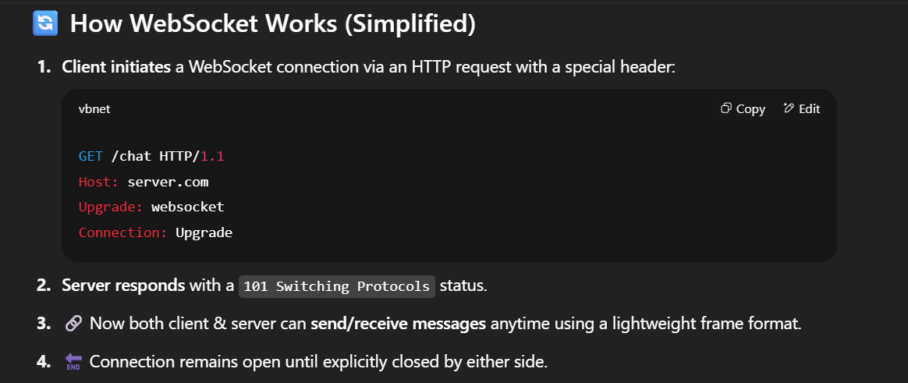
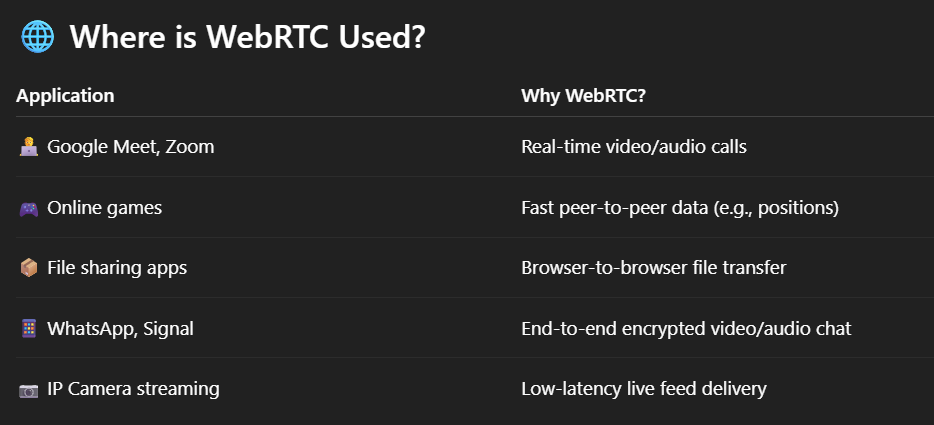
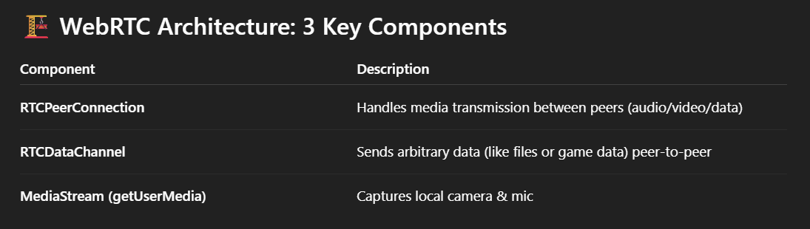

1. TCP V/S UDP
	**TCP (Transmission Control Protocol)** and **UDP (User Datagram Protocol)** are the two core **transport layer protocols** in the **Internet Protocol Suite (TCP/IP)**
	They both send data over the network — but in very **different** ways.
	
	### 🔁 TCP – Reliable & Connection-Oriented
		✅ Key Features:
		Connection-Oriented (3-way handshake)
		Reliable – guarantees delivery
		Ordered – packets arrive in order
		Error-checked* and retransmitted if lost
		Slower due to overhead
	    
		🧠 Real-world Use Cases:
		Web browsing (HTTP/HTTPS)
		Email (SMTP, IMAP, POP3)
	    File transfer (FTP, SFTP)
	    Database connections (MySQL, PostgreSQL)
	
	⚡ UDP – Fast & Connectionless
		✅ Key Features:
		- Connectionless
		- Unreliable– no guarantee of delivery or order
	    - No retransmission of lost packets
	    - Very fast, low overhead
	    
		🧠 Real-world Use Cases:
		Live streaming (YouTube Live, Twitch)
	    Online gaming
	    VoIP calls (Zoom, Skype)
	    DNS queries
	    Video conferencing
	
	

2. What is http (1/2/3) & https 
	**HTTP (HyperText Transfer Protocol)** is the **application-layer protocol** used for communication between **clients (like browsers)** and **servers** on the web.
	
	## 📜 **HTTP/1.0 (Legacy - 1996)**
		Every single request (image,CSS,JS,HTML) required a new TCP connection.
	    No keep-alive → Too many handshakes = slow websites.
    💥 **Problem**: High latency, redundant connections, poor performance for modern webpages with 100+ assets.
	
	## ⚙️ **HTTP/1.1 (Standard for 15+ years)**
	✅ Improvements:
		Persistent Connections (Keep-Alive): Reuse same TCP connection
		Pipelining (but rarely used): Try sending multiple requests without waiting
	    Chunked Transfers: Stream data progressively
	    
	 ❌ But major limitation:
		Head-of-Line Blocking (HoLB) – only one outstanding request is handled at a time in a connection.  
		Others wait, even if ready!
	💡 Example: You open Amazon.com → 1 HTML + 20 images = delays due to sequential handling.
	
	## ⚡ **HTTP/2 (2015)**
		A complete rewrite of how data flows between client & server — but keeping the same HTTP semantics (GET, POST, etc.)
	
	✅ Major Fixes:
		Binary Protocol (faster parsing than text)
	    Multiplexing – multiple parallel requests over a single TCP connection!
	    Header Compression (HPACK)
	    Server Push – server can proactively send assets before the client asks
    
	⚠️ Still suffers from:
		TCP-level Head-of-Line Blocking: If one packet is lost → entire TCP stream is held up
	    Especially bad on mobile networks
	💡 Example: On HTTP/2, if 1 image packet is lost, **ALL parallel streams stall**, even for CSS/JS.
	
	## 🚀 **HTTP/3 (2022 – based on QUIC)**
		Built to eliminate **TCP bottlenecks** by using **UDP + QUIC**.
	
	✅ Fixes in HTTP/3:
		**No TCP** → Uses **UDP** with QUIC (reliable, multiplexed, encrypted)
	    **0-RTT**: Connection starts instantly (no TCP + TLS handshake delay)
	    **Independent Streams**: Packet loss in one doesn’t block others
	    **Built-in encryption (TLS 1.3)**
    💡 On mobile or flaky Wi-Fi, HTTP/3 performs **much better** than HTTP/2.
    
	🧠 What Is QUIC (used in HTTP/3)?
		QUIC = Quick UDP Internet Connections  
		A protocol developed by Google, using **UDP** with built-in **TLS**, **multiplexing**, and **0-RTT** (zero round-trip) handshakes.
	
	## 🔐 What is HTTPS?
		HTTPS = HTTP + TLS encryption
		It secures the communication between browser and server
	    TLS adds a handshake before HTTP messages start flowing
	    This can be done with any version of HTTP
	    Protects against **eavesdropping**, **tampering**, and **MITM attacks**
		Mandatory for login forms, payment gateways, modern websites, etc.
	
	
	
	
	YouTube links :- https://www.youtube.com/watch?v=UMwQjFzTQXw and https://www.youtube.com/watch?v=ocGtt0IX0Js

3. Web sockets
	**Web Sockets** are a communication protocol that provides a **full-duplex**, **persistent**, and **bi-directional** connection between client and server over a **single TCP connection**.
	Unlike HTTP, which is **request-response based**, Web Sockets allow both client and server to **send messages at any time** — without re-establishing the connection.
	
	Examples :- Chat apps, Live stock data, multiplayer games, live score apps, dashboards
	
	
	
	

4. WEBRTC and video streaming 
	**WebRTC (Web Real-Time Communication)** is an open-source project and set of protocols that enables **real-time audio, video, and data communication** directly between **browsers or devices** — **without requiring plugins or third-party software**.
	It’s designed for **peer-to-peer** (P2P) communication — which means two users can connect directly to each other with minimal latency.
	
	For Interview :- 
	- WebRTC is a browser-native protocol for real-time communication over peer-to-peer connections.  
	- It’s ideal for video calls, live audio, and even file sharing. It uses STUN/TURN servers for NAT traversal and establishes secure, low-latency connections directly between users.  
	- Unlike traditional streaming (e.g., HLS), WebRTC is ultra-low latency and bi-directional.
	
	
	
	## 🛠️ How WebRTC Connection is Established
	1)  **Media Access**
		- User grants access to webcam/mic via `getUserMedia()`.
	2) **Signaling (Out-of-scope for WebRTC itself)**
		- WebRTC **needs a signaling server** (like via WebSocket or HTTP) to exchange:
			- **SDP (Session Description Protocol)**: codec, IP, media info
            - **ICE Candidates**: possible network paths for communication
	3) **NAT Traversal (ICE + STUN/TURN)**
		- Helps establish P2P even when users are behind firewalls or NAT.
		- **STUN**: Finds public IP.
		- **TURN**: Relay server fallback if direct P2P fails.
	4) **Peer Connection**
		- Once signaling + ICE is complete, **direct peer-to-peer connection** is established.
	
	
	
	###  🔐 Bonus: WebRTC Security
	WebRTC is **secure by default**:
	- **DTLS** secures signaling and data.
    - **SRTP** encrypts media streams.
    - HTTPS is required to access media devices (camera/mic).
	
5.  TLS Handshake
	A TLS handshake is the process that establishes a secure connection between a client and a server using the Transport Layer Security (TLS) protocol, previously known as SSL.
	
	
	
	## 1️⃣ Traditional (TLS 1.2 – RSA or DH based)
		Client Hello
			- Client → Server
			- Proposes supported TLS version, cipher suites, random number, etc.
			
		 Server Hello
			 - Server → Client
			 - Chooses cipher suite, sends its certificate (public key),server random.
        Key Exchange
	        - Client validates certificate, generates a pre-master secret, encrypts with server’s public key, sends to server.
	        - Both sides derive the same session key using client random + server random + pre-master secret.
	        
        Session Established
	        - Both now use symmetric encryption (AES, etc.) for fast communication.
        
    ⚡️ Problem:
    - Many round trips → slower.
    - Doesn’t hide metadata (like SNI, cipher lists).
	
	## 2️⃣ Modern (TLS 1.3 – Default today)
		TLS 1.3 simplified the handshake for speed + security:
		
		Client Hello
			- Client proposes ciphers, TLS version, and also sends key share (Diffie-Hellman params).
			
		Server Hello
			- Server selects cipher, sends back its key share + certificate.
			
		Key Agreement
		- Both compute session key (using Diffie-Hellman exchange).
		
		Finished
			- Session established in just 1 round-trip (1-RTT).
			- Supports 0-RTT resumption → client can send data immediately on reconnect.
	
	# 📝 Interview Tip
	If asked:  👉 _“How does TLS ensure secure communication?”_
	Answer:
	TLS uses asymmetric encryption during handshake to agree on a shared session key. After that, symmetric encryption secures all data (fast + secure). TLS 1.3 reduced handshake round trips, added forward secrecy, and enabled 0-RTT resumption.
