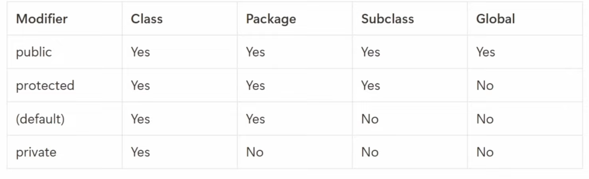
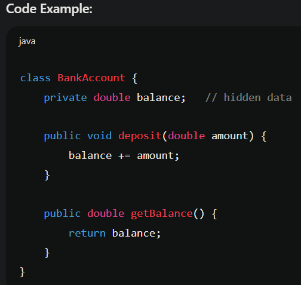

Classes & Object 
	**What:**
		- **Class** → Blueprint (defines attributes + behaviors).
        - **Object** → Instance of a class (real-world entity).
    **Analogy:**
		- Class = Car design blueprint.
		- Object = A BMW parked outside.
	
- Access modifier 
	
	
	When Class is empty only 1 byte of memory gets allocated.
	Access Modifiers : Public, Private(only inside class), Protected(class and child)

Constructors 
	

1. Encapsulation 
	- **What:** Wrapping **data + methods** that operate on that data inside one unit (class).
	- **Analogy:** Think of a **capsule** — medicine + outer shell. Data is safe inside.
	
	
	- Advantage :
		- Security 
		- Ease of maintainence 
		- Enhanced flexibility
		- Enhance readability
	- Disadvantage :
		- slight overhead
		- complexity

2. Abstraction
	- **What:** Show only **essential details**, hide unnecessary complexity.
	- **Analogy:** Car → You just use steering & pedals, you don’t see the engine complexity.
	
		In programming, abstraction is usually achieved with:
		- **Access modifiers** (like `private`, `protected`, `public`): Hide internal details and expose only what users need.
		- **Abstract classes & interfaces**: Provide a contract or template that hides implementation.
		
	- Advantage :
		- Code maintainability
		- enhance flexibility 
		- Increased security 
	- Disadvantage :
		- Over using of abstraction
		- overhead

3. Inheritance 
	- **What:** Child class acquires properties/behavior of parent class.
	- **Analogy:** A child inherits traits from parents.
	
	
	
	Type of Inheritance :
		- Single 
		- Multiple :- create dynamic problem (behaves different in c++ and java)
		- Multi-level
		- Hybrid
		- Hierarchical
	- Advantage :
		- Code reusability 
		- Ease of Maintainence
		- extensibility 
		- supports polymorphism
	- Dis-Advantage :
		- Increased coupling 
		- complexity

4. Polymorphism
	- **What:** One name, many forms.
	    - **Compile-time (Overloading):**
		    - **Function Overloading:** Same method name, different parameters.
		    - **Operator Overloading:** Same operator has different function
	    - **Runtime (Overriding):** Child changes parent’s method.
    - **Analogy:** Word “run” → you can run a race, run a program, run a company.
	- Advantage:
		- Code Reusability
		- Flexibility
		- extensibility 
	- Dis-advantage :
		- complexity 
		- performance overhead
	
	
	
5. Composition (v/s Inheritance)
	- **Definition:**  
	    Composition means **“has-a” relationship** → One class is made up of (or uses) other classes.
	- **Analogy:**
		- A **Car has an Engine**.
		- An **Employee has an Address**.
		- You don’t say _Car is an Engine_ — you say _Car has an Engine_.
        
    So, instead of inheriting properties, you **reuse functionality by containing objects** inside class.
	
	
	Here:
	- `Car` is not an `Engine`.
	- `Car` **has** an `Engine`.
	
	🔹 Inheritance vs Composition
	- **Inheritance (“is-a”):**
		- A **Dog is an Animal**.
        - A **Square is a Shape**.
    - **Composition (“has-a”):**
	    - A **Car has an Engine**.
	    - A **Library has Books**.
	
	🔹 When to Prefer Composition over Inheritance?
		👉 **Golden Rule:** _Favor composition over inheritance_ (a key OOP design principle).
		Use **Composition when:**
		 1)  **“Has-a” relationship** makes more sense than “is-a”.
			 - Example: Car has an Engine, not Car is an Engine.
        2) **You want flexibility (loose coupling).**
	        - With composition, you can replace Engine with ElectricEngine or PetrolEngine without changing Car.
	    3) **Avoiding Fragile Base Class Problem.**
		    - If you inherit from a base class and base class changes → child breaks. Composition avoids this.
		4) **Behavioral reuse without hierarchy.**
			- Example: Instead of inheriting `Logging` class everywhere, just include it via composition.
			
    **Why is composition more flexible than inheritance?**  
    ✅ Answer: Because you can change behavior at runtime (by injecting a different object), while inheritance is fixed at compile time.
	- Example: Want a Car with **PetrolEngine** today and with **ElectricEngine** tomorrow? → Use composition.

6. Interfaces (with Polymorphism )
	- Definition  :- In OOPs, an **interface** is a blueprint or a contract that defines a set of methods that a class must implement. It specifies _what_ a class should do, without defining _how_ it should do it. Any class that "implements" an interface agrees to this contract and must provide its own concrete, specific implementation for all the methods declared in the interface.
	
	// The interface defines the contract
		public interface IShape {
		    double getArea();
		    void draw();
		}
	
	// Concrete class for a Circle
	public class Circle implements IShape {
	    private double radius;
	
	    public Circle(double radius) {
	        this.radius = radius;
	    }
	
	    @Override
	    public double getArea() {
	        return Math.PI * radius * radius;
	    }
	
	    @Override
	    public void draw() {
	        System.out.println("Drawing a circle with radius " + radius);
	    }
	}
	
	// Concrete class for a Rectangle
	public class Rectangle implements IShape {
	    private double width;
	    private double height;
	
	    public Rectangle(double width, double height) {
	        this.width = width;
	        this.height = height;
	    }
	
	    @Override
	    public double getArea() {
	        return width * height;
	    }
	
	    @Override
	    public void draw() {
	        System.out.println("Drawing a rectangle with width " + width + " and height " + height);
	    }
	}
	
7. Abstract Classes 
	An **abstract method** is essentially a **contract** or a **promise**. The abstract class promises that any concrete subclass will implement that method and return a value of the specified type.
	
	 - Has no constructor 
	 - Has concrete(normal), abstract, static method and so on
	 -  doesn't have any object, object can be created using abstract class name but for subclass 
	 - 

8. Class Diagram 
9. Generics and Wildcards 

