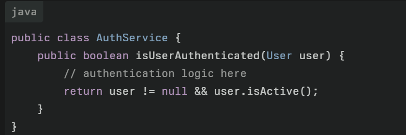

1.  **Single Responsibility Principle (SRP)**
	- **Definition:** A class should have **only one reason to change**.
	- **Why:** Keeps code clean, reduces bugs when requirements change.
	- **Analogy:** A restaurant chef should cook, not also do billing + cleaning.
	
	
	

2. **Open-Closed Principle (OCP)**
	- **Definition:** Classes should be **open for extension but closed for modification**.
	- **Why:** You don’t want to modify old code every time a new feature comes.
	
	
	

3. **Liskov Substitution Principle (LSP)**
	- The Liskov Substitution Principle (LSP) states that objects of a superclass should be replaceable by objects of its subclass without affecting the correctness of the program. This principle is key to robust, maintainable object-oriented design, ensuring that inheritance properly supports extensibility and reliable polymorphism.
	- **Definition:** Subclasses should be **substitutable** for their parent classes.
	- **Why:** If code using parent breaks when you pass child, LSP is violated.
	- **Analogy:** If Bird can fly, then every subclass (Sparrow, Parrot) should fly. But what about Ostrich? 🦤
	
	
	

4. **Interface Segregation Principle (ISP)**
	- **Definition:** Don’t force classes to implement methods they don’t need.
	- **Why:** Prevents “fat” interfaces.
	- **Analogy:** A waiter shouldn’t be forced to also implement cooking methods.
	
	
	

5. **Dependency Inversion Principle (DIP)**
	- **Definition:** Depend on **abstractions, not concrete classes**.
	- **Why:** Makes code flexible, testable.
	- **Analogy:** A plug depends on socket **interface** (shape/voltage), not on a particular brand.
	
	
	

Advantage :- 
- Scalability 
- Maintainability
- Testability
- Readability 

# ✅ Summary (to fit in your mind forever):
- **SRP** → One class, one job.
- **OCP** → Add new, don’t modify old.
- **LSP** → Subclasses should fit parent’s shoes.
- **ISP** → Don’t force unwanted methods.
- **DIP** → Depend on interfaces, not implementations.

#### More Software development rules 
- **DRY (do-not repeat yourself)**
	It is a software development guideline that emphasizes reducing duplication of code and logic within a system. The main idea is that every piece of knowledge or logic should have a single, clear, and authoritative representation.
	
	Imagine you have multiple places in your application where you check if a user is authenticated—before accessing profile data, posting comments, or performing admin actions.
	- Without DRY: You write the authentication check code separately in each module, copying and pasting it multiple times.
	- With DRY: You extract the authentication logic into a single method or class like `AuthService.isUserAuthenticated(user)`.
	
	

- **KISS (keep it simple, stupid)**
	The KISS principle stands for "Keep It Simple, Stupid." It emphasizes that designs and solutions should be as simple as possible while still achieving the desired functionality
	
	## Example: Simple Calculator Application
	
	Suppose you need to create a basic calculator that performs addition, subtraction, multiplication, and division.
	
	- Instead of building a complex class hierarchy with multiple patterns and abstractions upfront,
	- Following KISS, you implement a straightforward `Calculator` class with simple methods for each operation:

- **YAGNI (You Aren't gonna need it)**
	The YAGNI rule stands for "You Aren't Gonna Need It." It is a software development principle that advises developers to only implement features when they are actually needed, rather than building them based on speculative future requirements
	
	## Example: To-Do List App Features
	Suppose you are tasked to create a simple to-do list app where users can add, delete, and mark tasks as complete.
	- Without YAGNI: You might start implementing features like task categorization, priority levels, reminders, social sharing, and even integration with calendars—anticipating future user needs.
	- With YAGNI: You focus only on the core features requested—adding, deleting, and marking tasks complete. Additional features are deferred until there's a clear demand for them.